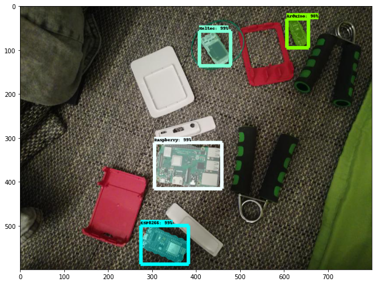

# Train a Mask R-CNN model with the Tensorflow Object Detection API

[](https://github.com/tensorflow/tensorflow/releases/tag/v2.5.0)



## 1. Installation

You can install the TensorFlow Object Detection API either with Python Package Installer (pip) or Docker, an open-source platform for deploying and managing containerized applications. For running the Tensorflow Object Detection API locally, Docker is recommended. If you aren't familiar with Docker though, it might be easier to install it using pip.

First clone the master branch of the Tensorflow Models repository:

```bash
git clone https://github.com/tensorflow/models.git
```

### Docker Installation

```bash
# From the root of the git repository (inside the models directory)
docker build -f research/object_detection/dockerfiles/tf2/Dockerfile -t od .
docker run -it od
```

### Python Package Installation

```bash
cd models/research
# Compile protos.
protoc object_detection/protos/*.proto --python_out=.
# Install TensorFlow Object Detection API.
cp object_detection/packages/tf2/setup.py .
python -m pip install .
```

> Note: The *.proto designating all files does not work protobuf version 3.5 and higher. If you are using version 3.5, you have to go through each file individually. To make this easier, I created a python script that loops through a directory and converts all proto files one at a time.

```python
import os
import sys
args = sys.argv
directory = args[1]
protoc_path = args[2]
for file in os.listdir(directory):
    if file.endswith(".proto"):
        os.system(protoc_path+" "+directory+"/"+file+" --python_out=.")
```

```
python use_protobuf.py <path to directory> <path to protoc file>
```

To test the installation run:

```bash
# Test the installation.
python object_detection/builders/model_builder_tf2_test.py
```

If everything installed correctly you should see something like:

```bash
...
[       OK ] ModelBuilderTF2Test.test_create_ssd_models_from_config
[ RUN      ] ModelBuilderTF2Test.test_invalid_faster_rcnn_batchnorm_update
[       OK ] ModelBuilderTF2Test.test_invalid_faster_rcnn_batchnorm_update
[ RUN      ] ModelBuilderTF2Test.test_invalid_first_stage_nms_iou_threshold
[       OK ] ModelBuilderTF2Test.test_invalid_first_stage_nms_iou_threshold
[ RUN      ] ModelBuilderTF2Test.test_invalid_model_config_proto
[       OK ] ModelBuilderTF2Test.test_invalid_model_config_proto
[ RUN      ] ModelBuilderTF2Test.test_invalid_second_stage_batch_size
[       OK ] ModelBuilderTF2Test.test_invalid_second_stage_batch_size
[ RUN      ] ModelBuilderTF2Test.test_session
[  SKIPPED ] ModelBuilderTF2Test.test_session
[ RUN      ] ModelBuilderTF2Test.test_unknown_faster_rcnn_feature_extractor
[       OK ] ModelBuilderTF2Test.test_unknown_faster_rcnn_feature_extractor
[ RUN      ] ModelBuilderTF2Test.test_unknown_meta_architecture
[       OK ] ModelBuilderTF2Test.test_unknown_meta_architecture
[ RUN      ] ModelBuilderTF2Test.test_unknown_ssd_feature_extractor
[       OK ] ModelBuilderTF2Test.test_unknown_ssd_feature_extractor
----------------------------------------------------------------------
Ran 20 tests in 91.767s

OK (skipped=1)
```

### 2. Gathering data

Now that the Tensorflow Object Detection API is ready to go, we need to gather the images needed for training. 

To train a robust model, the pictures should be as diverse as possible. So they should have different backgrounds, varying lighting conditions, and unrelated random objects in them.

You can either take pictures yourself, or you can download pictures from the internet. For my microcontroller detector, I took about 25 pictures of each individual microcontroller and 25 pictures containing multiple microcontrollers.


You can use the [resize_images script](resize_images.py) to resize the image to the wanted resolutions.

```bash
python resize_images.py -d images/ -s 800 600
```

After you have all the images, move about 80% to the object_detection/images/train directory and the other 20% to the object_detection/images/test directory. Make sure that the images in both directories have a good variety of classes.

## 3. Labeling data

After you have gathered enough images, it's time to label them, so your model knows what to learn. In order to label the data, you will need to use some kind of labeling software.

For object detection, we used [LabelImg](https://github.com/tzutalin/labelImg), an excellent image annotation tool supporting both PascalVOC and Yolo format. For Image Segmentation / Instance Segmentation there are multiple great annotations tools available. Including, [VGG Image Annotation Tool](http://www.robots.ox.ac.uk/~vgg/software/via/), [labelme](https://github.com/wkentaro/labelme), and [PixelAnnotationTool](https://github.com/abreheret/PixelAnnotationTool). I chose labelme, because of its simplicity to both install and use.


## 4. Generating Training data

With the images labeled, we need to create TFRecords that can be served as input data for the training of the model. Before we create the TFRecord files, we'll convert the labelme labels into COCO format. This can be done with the [labelme2coco.py script](images/labelme2coco.py).

```bash
python labelme2coco.py train train.json
python labelme2coco.py test test.json
```

Now we can create the TFRecord files using the [create_coco_tf_record.py script](create_coco_tf_record.py).

```bash
python create_coco_tf_record.py --logtostderr --train_image_dir=images/train --test_image_dir=images/test --train_annotations_file=images/train.json --test_annotations_file=images/test.json --output_dir=./
```

After executing this command, you should have a train.record and test.record file inside your object detection folder.

## 5. Getting ready for training

The last thing we need to do before training is to create a label map and a training configuration file.

### 5.1 Creating a label map

The label map maps an id to a name. We will put it in a folder called training, which is located in the object_detection directory. The labelmap for my detector can be seen below.

```bash
item {
    id: 1
    name: 'Arduino'
}
item {
    id: 2
    name: 'ESP8266'
}
item {
    id: 3
    name: 'Heltec'
}
item {
    id: 4
    name: 'Raspberry'
}
```

The id number of each item should match the ids inside the train.json and test.json files.

```json
"categories": [
    {
        "supercategory": "Arduino",
        "id": 0,
        "name": "Arduino"
    },
    {
        "supercategory": "ESP8266",
        "id": 1,
        "name": "ESP8266"
    },
    {
        "supercategory": "Heltec",
        "id": 2,
        "name": "Heltec"
    },
    {
        "supercategory": "Raspberry",
        "id": 3,
        "name": "Raspberry"
    }
],
```

### 5.2 Creating the training configuration

Lastly, we need to create a training configuration file. At the moment only one Mask-RCNN model is supported with Tensorflow 2.

From the [Tensorflow Model Zoo](https://github.com/tensorflow/models/blob/master/research/object_detection/g3doc/tf2_detection_zoo.md):
| Model name  | Speed (ms) | COCO mAP | Outputs |
| ------------ | :--------------: | :--------------: | :-------------: |
| [Mask R-CNN Inception ResNet V2 1024x1024](http://download.tensorflow.org/models/object_detection/tf2/20200711/mask_rcnn_inception_resnet_v2_1024x1024_coco17_gpu-8.tar.gz) | 301 | 39.0/34.6 | Boxes/Masks |

The [base config](https://github.com/tensorflow/models/blob/master/research/object_detection/configs/tf2/mask_rcnn_inception_resnet_v2_1024x1024_coco17_gpu-8.config) for the model can be found inside the [configs/tf2 folder](https://github.com/tensorflow/models/tree/master/research/object_detection/configs/tf2).

Copy the config file to the training directory. Then open it inside a text editor and make the following changes:

* Line 12: change the number of classes to number of objects you want to detect (4 in my case)

* Line 125: change fine_tune_checkpoint to the path of the model.ckpt file:

    * ```fine_tune_checkpoint: "<path>/mask_rcnn_inception_resnet_v2_1024x1024_coco17_gpu-8/checkpoint/ckpt-0"```

* Line 126: Change fine_tune_checkpoint_type to detection

* Line 136: change input_path to the path of the train.record file:

    * ```input_path: "<path>/train.record"```

* Line 156: change input_path to the path of the test.record file:

    * ```input_path: "<path>/test.record"```

* Line 134 and 152: change label_map_path to the path of the label map:

    * ```label_map_path: "<path>/labelmap.pbtxt"```

* Line 107 and 147: change batch_size to a number appropriate for your hardware, like 4, 8, or 16.

## 6. Training the model

To train the model execute the following command in the command line:

```bash
python model_main_tf2.py --pipeline_config_path=training/mask_rcnn_inception_resnet_v2_1024x1024_coco17_gpu-8.config --model_dir=training --alsologtostderr
```

If everything was setup correctly, the training should begin shortly, and you should see something like the following:


Every few minutes, the current loss gets logged to Tensorboard. Open Tensorboard by opening a second command line, navigating to the object_detection folder and typing:

```tensorboard --logdir=training/train```

This will open a webpage at localhost:6006.


The training script saves checkpoints about every five minutes. Train the model until it reaches a satisfying loss, then you can terminate the training process by pressing Ctrl+C.

## 7. Exporting the inference graph

Now that we have a trained model, we need to generate an inference graph that can be used to run the model.

```bash
python /content/models/research/object_detection/exporter_main_v2.py \
    --trained_checkpoint_dir training \
    --output_directory inference_graph \
    --pipeline_config_path training/mask_rcnn_inception_resnet_v2_1024x1024_coco17_gpu-8.config
```

## Author
 **Gilbert Tanner**
 
## Support me

<a href="https://www.buymeacoffee.com/gilberttanner" target="_blank"></a>
